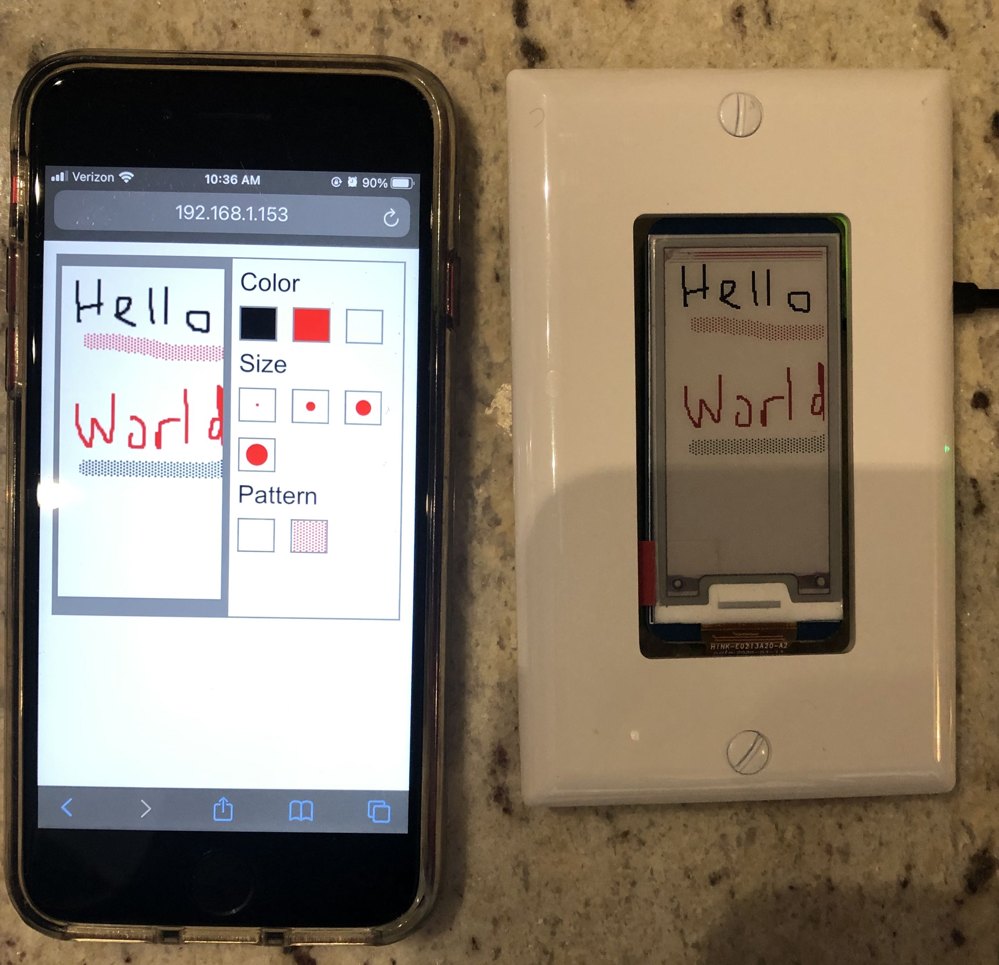

# E-ink Light Switch Display



In our apartment, there is an extra light switch that doesn't do anything.  I decided to fill the space with an e-ink display that displays doodles or notes that you send to it.

The extra light switch has an opening of about 1.3" x 2.6".  Luckily, there happen to be little e-ink/e-paper displays that are just a bit smaller, used for [electronic shelf labeling](https://www.eink.com/electronic-shelf-label.html) - the label below a retail item that shows product details and price.

Waveshare sells these 2.13" displays as [Raspberry Pi HATs](https://www.waveshare.com/product/raspberry-pi/displays/e-paper.htm?dir=asc&order=price) for about $20.  They are exactly the same size as a Raspberry Pi Zero.

I chose the Waveshare 3-color 2.13" e-ink display HAT ([amazon](https://www.amazon.com/waveshare-2-13inch-HAT-Resolution-Raspberry/dp/B07Q22WDB9), [waveshare](https://www.waveshare.com/wiki/2.13inch_e-Paper_HAT_(B))) and attached it to a Raspberry Pi Zero W.

The Raspberry Pi attached to the display is configured to run as a web server.  It serves up a little drawing canvas for making doodles on your phone or computer, a sort of MS-paint lite. As your make your drawing, the e-ink display displays it.

## Making the device

Parts:

- [3-color 2.13" e-ink display HAT](https://www.amazon.com/waveshare-2-13inch-HAT-Resolution-Raspberry/dp/B07Q22WDB9) - Several other waveshare models should work with minor modifications.  The black-and-white only model has a better refresh rate, and supports partial refresh, which may work better for a live information panel.
- [Raspberry Pi Zero W with headers](https://www.amazon.com/waveshare-Raspberry-Pi-Zero-Pre-Soldered/dp/B07W3GJTM1/) - I was too lazy to solder the headers myself.
- [AC-DC 5V 700ma power supply](https://www.amazon.com/gp/product/B076K8HT8Z/) - here's a slim one I chose for mounting inside an electrical box that I can connect directly to mains power.  You could also gut an old phone charger you have laying around, or power it some other way.  700ma is more than sufficient for this application.

## Configuring the Pi

The server runs on the switch itself, and serves the drawing canvas as a webpage that you can get to from your phone or computer.

### Pi zero setup

#### Headless wireless and ssh config
You can setup the raspberry pi without access to a keyboard or hdmi display, using [headless setup](https://www.raspberrypi.org/documentation/configuration/wireless/headless.md). TL;DR, after you write the image to a microSD card, create two files in the `boot` volume, an empty file called `ssh` to allow ssh access, and another file called `wpa_supplicant.conf` with your 2.4Ghz wireless access point info.

For better interactive ssh performance, you can add
```
IPQoS cs0 cs0
```
to the end of the Pi's 

#### Connect to the Raspberry Pi
Assuming you set up the pi correctly, you should be able to ssh to it via its IP address (you can find that out by looking at your router's clients table).  See step 4 of the [Raspberry Pi SSH documentation](https://www.raspberrypi.org/documentation/remote-access/ssh/README.md) to connect to your Pi from another computer.

#### Enable SPI
The display uses SPI to communicate, which has to be enabled via a config.

Connect to the raspberry pi via ssh, then:

```
sudo raspi-config
```

Choose `Interfacing Options` -> `SPI` -> `Yes`  to enable the SPI interface.


#### Disable wireless power management
Wireless power management will shut down the wlan0 interface when it is not in use, which makes the server unreliable.  In this application, the Pi is powered all the time anyway, so the power management features are not necessary.

There are several ways to do this, but an easy way that is not version-specific is to add a command to disable the power management during boot.

on the Pi, in `/etc/rc.local`, add this line at the top:

```
iwconfig wlan0 power off
```

Reboot (`sudo reboot`) for these changes to take effect.

#### Dependencies
The server has several python dependencies:

- `python3-pil` (image processing, converting the image to 3-color and monochrome)
- `python3-spidev`, `python3-rpi.gpio` (interact with the display)

It is probably easiest to directly install these with:

```
sudo apt get install python3-pil python3-spidev python3-rpi.gpio
```

You could instead create a virtualenv with these dependencies, but you would need to have a compiler installed and the development version of the transitive dependencies for that.


## Getting and running the server
On the Pi:

Install `git` with `sudo apt-get install git` if you don't already have it.

```
git clone https://github.com/slackhappy/einklightswitch

./setup.sh

python3 main.py --device epd2in13b_V3
```

Running setup.sh downloads the library from waveshare's [e-Paper github repo](https://github.com/waveshare/e-Paper).  You can run `python3 main.py -h` to see a list of supported devices.  The library methods aren't consistent across devices so using a different method requires some tweaking of `main.py`.

Once you see a message like `INFO: Server up on port X`, you should be able to connect to the server using your phone or computer with a web browser if you are on the same wireless network.


